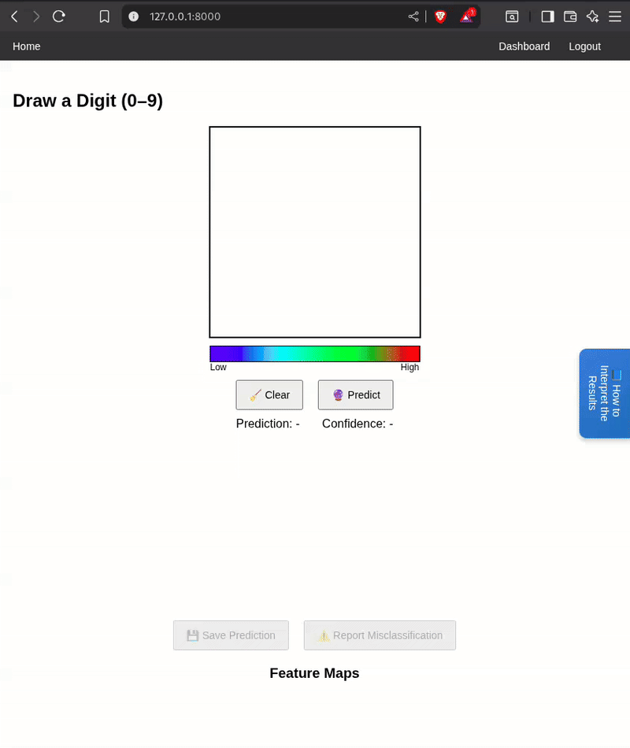

# 🧠 CNNViz – Interactive Digit Classifier with Explainability

CNNViz is an interactive web app built with **Django** + **PyTorch** that allows users to draw digits (0–9) on a canvas and visualize how a Convolutional Neural Network (CNN) makes predictions.

It goes beyond prediction by offering **explainability features** like **Grad-CAM heatmaps** and **feature map visualization** for deeper understanding of CNNs. Users can also **save predictions**, **report misclassifications**, and review them later in the dashboard.

---

## 🚀 Features

* ✍️ **Digit Drawing Canvas** – Draw any digit (0–9) directly in the browser.
* 🔮 **Prediction with Confidence** – Model predicts the digit with probability distribution across all classes.
* 🌡 **Grad-CAM Heatmap** – Highlights the important strokes/regions the model focused on.
* 🖼 **Feature Maps** – Visualize intermediate CNN feature maps (Conv1, Conv2).
* 📊 **Probability Bar Chart** – See per-class confidence scores.
* 💾 **Save Predictions** – Store predictions in the database.
* 🚩 **Report Misclassifications** – Report wrong predictions with a reason.
* 📂 **Dashboard** – View all saved predictions and reports.
* 🛠 **Re-run Predictions** – Re-generate results (heatmaps, confidence, etc.) for saved inputs.

---

## 📂 Project Structure

```
CNNVIZ/
│── classifier/          # Main app (ML + views + templates)
│   ├── ml/              # ML models, Grad-CAM, feature maps
│   ├── static/          # CSS, JS, icons
│   ├── templates/       # HTML templates (canvas, dashboard, etc.)
│   ├── views.py         # Main API + page views
│   ├── models.py        # Prediction + Report models
│
│── cnnviz/              # Django project settings
│   ├── settings.py
│   ├── urls.py
│   ├── asgi.py
│   ├── wsgi.py
│   ├── __init__.py
|
│
│── data/MNIST/raw/      # MNIST dataset files
│── media/predictions/   # Saved predictions (canvas + heatmaps)
│── models/              # Trained CNN model (.pt)
│── db.sqlite3           # SQLite database
│── manage.py
│── demo.gif             # Demo GIF for README
```

---

## ⚙️ Installation

### 1️⃣ Clone the repository

```bash
git clone https://github.com/your-username/CNNViz.git
cd CNNViz
```

### 2️⃣ Create a virtual environment

```bash
python -m venv venv
source venv/bin/activate   # On Linux/Mac
venv\Scripts\activate      # On Windows
```

### 3️⃣ Install dependencies

```bash
pip install -r requirements.txt
```

### 4️⃣ Apply migrations

```bash
python manage.py migrate
```

### 5️⃣ Run the server

```bash
python manage.py runserver
```

---

## 📊 Demo

Here’s how the app looks in action:



* Draw a digit → Click **Predict** → See Grad-CAM, feature maps, and probability chart.
* Save your prediction or report a misclassification.
* View history in **Dashboard**.

---

## 🧩 Tech Stack

* **Backend**: Django, Django ORM, SQLite
* **ML Model**: PyTorch CNN trained on MNIST
* **Explainability**: Grad-CAM, Feature Maps
* **Frontend**: HTML, CSS, JavaScript, Chart.js

---

## 👨‍💻 Author

* **Your Name** – [GitHub](https://github.com/ganesh1729m) | 

---
